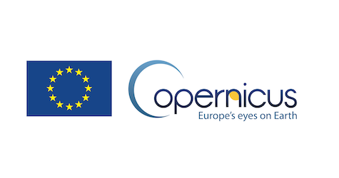

# CDAB Software Test Suite

Copernicus Sentinels Data Access Worldwide Benchmark Test Suite is the software suite used to run Test Scenarios for bechmarking various Copernicus Data Provider targets.

The current supported Target Sites are

* Data Access Hubs using [DHuS Data Hub](https://sentineldatahub.github.io):
  * [Copernicus Open Access Hub (aka SciHub)](https://scihub.copernicus.eu/)
  * [Copernicus Open Access Hub API (aka APIHub)](https://scihub.copernicus.eu/twiki/do/view/SciHubWebPortal/APIHubDescription)
  * [Copernicus Collaborative Data Hub (aka ColHub)](https://colhub.copernicus.eu/)
  * [Copernicus Sentinels International Access Hub (aka IntHub)](https://inthub.copernicus.eu/)
  * Any Data Access Hubs using [DHuS Data Hub](https://sentineldatahub.github.io) software
* DIASes
  * [CREODIAS](https://creodias.eu/)
  * [Mundi Web Services](https://mundiwebservices.com/)
  * [ONDA](https://www.onda-dias.eu/)
  * [Sobloo](https://sobloo.eu/)

# Repository Content

This repository is a public repository with all the source code used for building the CDAB Test Suite

The CDAB Test Suite is built automatically providing a docker image available publicly at [esacdab/testsuite](https://hub.docker.com/repository/docker/esacdab/testsuite) that can be used as Test Site.

# Getting Started

You can start now using the Test Suite following the [Getting Started guide](https://github.com/Terradue/cdab-testsuite/wiki)

# Software licenses

The CDAB Test Suite is released as open source software under the GNU Affero General Public License (AGPLv3). This repository contains the source code of an executable DotNet solution combining the unmodified exact copies of the following software packages as dynamic libraries configured as dependencies:

| Software package | Copyright license type | Link to license |
| --- | --- | --- |
| log4net | Apache 2.0 | https://logging.apache.org/log4net/license.html |
| Newtonsoft | MIT | https://github.com/JamesNK/Newtonsoft.Json/blob/master/LICENSE.md |
| Mono.Options | MIT | https://github.com/mono/mono/blob/master/mcs/class/Mono.Options/Mono.Options/Options.cs (stated in source code) |
| YamlDotNet | MIT | https://github.com/aaubry/YamlDotNet/blob/master/LICENSE.txt |
| Terradue.OpenSearch | AGPL 3.0 | https://github.com/Terradue/DotNetOpenSearch/blob/master/LICENSE |
| Terradue.OpenSearch.SciHub | AGPL 3.0 | https://github.com/Terradue/DotNetOpenSearch/blob/master/LICENSE |
| Terradue.OpenSearch.Asf | AGPL 3.0 | https://github.com/Terradue/DotNetOpenSearch/blob/master/LICENSE |
| Terradue.GeoJson | AGPL 3.0 | https://github.com/Terradue/DotNetOpenSearch/blob/master/LICENSE |
| Terradue.ServiceModel.Syndication | AGPL 3.0 | https://github.com/Terradue/DotNetOpenSearch/blob/master/LICENSE |
| Terradue.Metadata.EarthObservation | AGPL 3.0 | https://github.com/Terradue/DotNetOpenSearch/blob/master/LICENSE |
| Terradue.ServiceModel.Ogc | AGPL 3.0 | https://github.com/Terradue/DotNetOpenSearch/blob/master/LICENSE |

The CDAB Test Suite is free software: it can be redistributed and/or modified under the terms of the GNU Affero General Public License (AGPLv3) as published by the Free Software Foundation, either version 3 of the License, or any later version.

Funded by

----

