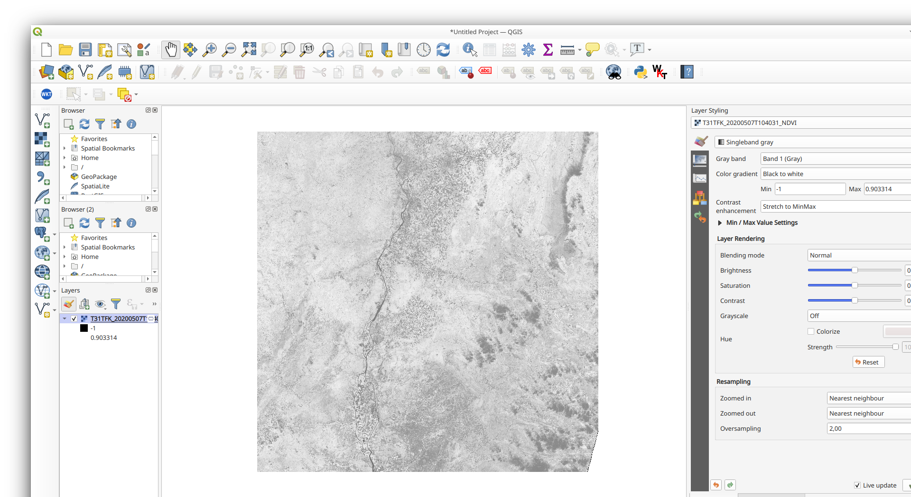

# Use Case Scenario #1 - NDVI mapping - Integration Procedures

## Development Environment installation procedure

1. Provision a virtual machine on the target site. Preferably with the following specification:
   - 2 CPU, 8GB RAM, 50GB disk
   - Debian or similar (Ubuntu)
   - with data offer access if required
  
2. Open a terminal on the provisioned machine.

3. Check that Python is available.

   ```console
   $ which python3
   /usr/bin/python3
   $ python3 --version
   Python 3.7.4
   ```

  If Python is not available, install it with the package manager and do point 3 again.

  ```console
  $ sudo yum install python3 python3-pip
  ```

4. Check that GDAL is available.

   ```console
   $ which gdalinfo
   /usr/bin/gdalinfo
   $ gdalinfo --version
   GDAL 2.4.2, released 2019/06/28
   ```

   If GDAL is not available, install it with the package manager and do point 4 again.

   ```console
   $ sudo add-apt-repository ppa:ubuntugis/ppa
   $ sudo apt-get update
   $ sudo apt-get install gdal-bin python3-gdal
   ```

5. Install required libraries.

   ```console
   $ pip3 install numpy
   ```

## Integration procedure 

1. Open a terminal on the previously set-up virtual machine. [10%]

2. Upload the current use case folder to the user folder using either SCP or the provider upload tool. [20%]

3. **Using the target site data access and following the documentation available at the target site**, get a relevant Sentinel2 Level1C product tile. Typically, Tile `T31TFK` of the `07 May 2020 10:40:31 GMT`. [40%]

   ```console
   $ curl -L -o S2A_MSIL1C_20200507T104031_N0209_R008_T31TFK_20200507T124549.zip https://store.terradue.com/download/sentinel2/files/v1/S2A_MSIL1C_20200507T104031_N0209_R008_T31TFK_20200507T124549
   ```

    Make the necessary commands to extract the product as a folder with band files available.

   ```console
   $ unzip S2A_MSIL1C_20200507T104031_N0209_R008_T31TFK_20200507T124549.zip
   ```

4. Run the NDVI script `ndvi.py` passing the folder with the images bands as argument. [60%]

   ```console
   $ ./ndvi.py /tmp/S2A_MSIL1C_20200507T104031_N0209_R008_T31TFK_20200507T124549.SAFE/GRANULE/L1C_T31TFK_A025459_20200507T104558/IMG_DATA/
   ```

5. Wait for the processing to complete. [80%]

6. In the same directory with the bands images, you should find a `tif` file with name ending with `_NDVI.tif`. [90%]

   ```console
   $ ls -l /tmp/S2A_MSIL1C_20200507T104031_N0209_R008_T31TFK_20200507T124549.SAFE/GRANULE/L1C_T31TFK_A025459_20200507T104558/IMG_DATA/
   ...
   T31TFK_20200507T104031_NDVI.tif
   ```

8. Download it to your computer and open it with QGIS. [100%]

   

## Application build procedure 

1. Open a terminal on the previously set-up virtual machine.

2. Go to the Use case folder.

3. Launch docker build prefixing the name with the target site docker hub repository (here docker.terradue.com).

   ```console
   $ docker build -t docker.terradue.com/cdab-ndvi .
   ```

4. Push the docker to the hub.

   ```console
   $ docker push docker.terradue.com/cdab-ndvi
   ```
