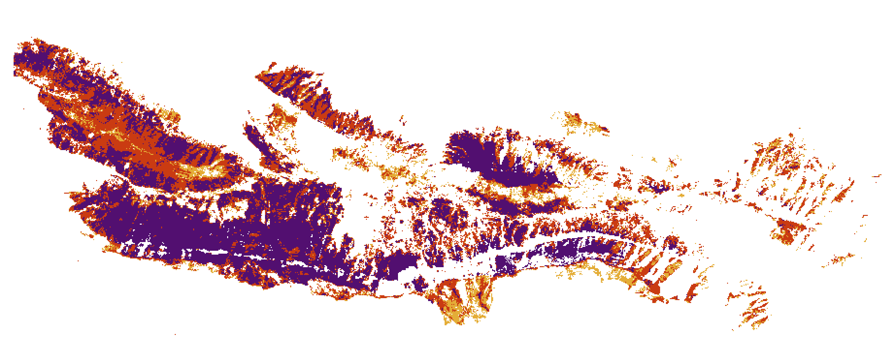

# Use Case Scenario #2 - Rapid mapping - Integration Procedures

## Development Environment installation procedure

1. Provision a virtual machine on the target site. Preferably with the following specification
    - 2 CPUs, 8GB RAM, 30GB disk
    - CentOS 7
    - Jupyter Lab (with Python 3 support), it can also be installed if not present.
    - With data offer access if required
  
2. Open a terminal on the provisioned machine and install some prequisites, and install, if necessary, **conda** on the virtual machine and create the conda environment.

   Transfer the included file _conda-install.sh_ on the virtual machine.

   Run the following commands to prepare conda and allow the creation of an environment:

   ```console
   sudo sh conda-install.sh
   source /opt/anaconda/etc/profile.d/conda.sh
   sudo chown $USER:$USER /opt/anaconda/
   ```

   Transfer the the included file _environment.yml_ there and create a new conda environment (name **env_burned_area**) and activate that environment using these commands and confirm where necessary (the environment creation takes a while; there might be some warnings, but they can be ignored):
  
   ```console
   conda env create --file environment.yml

   conda activate env_burned_area
   ```

   You may have to log out and log in again for the changes to take effect.

3. Start Jupyter Lab.

   When in the correct environment (shown in the command prompt), you can configure and start Jupyter Lab.

   The following steps are taken from [this page](https://agent-jay.github.io/2018/03/jupyterserver/).

   Execute the commands one after another and follow the instructions:
  
   ```console
   # Create a configuration file template
   jupyter notebook --generate-config
  
   # Set a password for accessing Jupyter and remember it,
   # the password hash is written to a file
   jupyter lab password
  
   # Create a self-signed certificate for a secure connection
   openssl req -x509 -nodes -days 365 -newkey rsa:2048 -keyout mycert.pem -out mycert.pem
   ```

   Edit the configuration file (usually _~/.jupyter/jupyter_notebook_config.py_).

   Add these lines to the file (setting the appropriate values for _certfile_ and _keyfile_):
   
   ```
   c.NotebookApp.certfile = u'<path-to-mycert.pem>'
   c.NotebookApp.keyfile = u'<path-to-mycert.pem>'
   c.NotebookApp.ip = '*'
   c.NotebookApp.open_browser = False
   c.NotebookApp.port = 9999
   c.NotebookApp.allow_remote_access = False
   ```

   Start Jupyter Lab

   ```console
   jupyter lab
   ```

   There should be log messages displayed confirming that Jupyter Lab is running.

4. Connect to Jupyter Lab.

   Using a new shell, use secure port-forwarding (tunnelling). Replace `user` and `hostname` with the values applying to your virtual machine.
  
   ```console
   ssh -i yourkey.pem -N -f -L 8888:localhost:9999 user@hostname
   ```

   Now you can access Jupyter Lab with your browser at https://localhost:8888/lab. Ignore possible browser security warnings. Use the previously set password to log in. 

## Integration procedure 

1. Open Jupyter Lab on the virtual machine or within the environment provided through the target site's web interface. [10%]

2. Upload the files scenario code files (_burned\_area.ipynb_ and the two helper _*.py_ files) to the workspace folder using the Jupyter upload functionality. [20%]

3. **Using the target site data access and following the documentation available at the target site**, get two relevant Sentinel-2 MSI L2A products. For instance, the products with the identifier `S2B_MSIL2A_20210305T171109_N0214_R112_T14RLP_20210305T212158` and `S2B_MSIL2A_20210424T170839_N0300_R112_T14RLP_20210424T211236` of April 2021 (Northern Mexico) [30%]

   * For **Sobloo**, do the following:

     The included file _sobloo-download.py_ is intended to make the download from Sobloo easy. Transfer that file on the virtual machine.

     Set the `$DATA_PATH` variable to the directory for local copies of the products and the `$SOBLOO_API_KEY` variable to your Sobloo API key, and download the files using the following commands:

     ```console
     python3 sobloo-download.py $DATA_PATH/S2B_MSIL2A_20210305T171109_N0214_R112_T14RLP_20210305T212158 S2B_MSIL2A_20210305T171109_N0214_R112_T14RLP_20210305T212158 "$SOBLOO_API_KEY"
     python3 sobloo-download.py $DATA_PATH/S2B_MSIL2A_20210424T170839_N0300_R112_T14RLP_20210424T211236 S2B_MSIL2A_20210424T170839_N0300_R112_T14RLP_20210424T211236 "$SOBLOO_API_KEY"
     ```

   * For **ONDA**, do the following:
  
     From the shell, mount the data volume as explained in [this page](https://www.onda-dias.eu/cms/knowledge-base/adapi-how-to-mount-unmount/).
     Set the `$DATA_PATH` variable to the directory for local copies of the products and copy the .zip files using the following commands:
  
     ```console
     # /local_path is the mountpoint for the data volume
     mkdir $DATA_PATH/S2B_MSIL2A_20210305T171109_N0214_R112_T14RLP_20210305T212158
     mkdir $DATA_PATH/S2B_MSIL2A_20210424T170839_N0300_R112_T14RLP_20210424T211236
     cp /local_path/S2/2A/MSI/LEVEL-2A/S2MSI2A/2021/03/05/S2B_MSIL2A_20210305T171109_N0214_R112_T14RLP_20210305T212158.zip $DATA_PATH/S2B_MSIL2A_20210305T171109_N0214_R112_T14RLP_20210305T212158
     cp /local_path/S2/2B/MSI/LEVEL-2A/S2MSI2A/2021/04/24/S2B_MSIL2A_20210424T170839_N0300_R112_T14RLP_20210424T211236.zip $DATA_PATH/S2B_MSIL2A_20210424T170839_N0300_R112_T14RLP_20210424T211236
     ```

   * For **CREODIAS**, make sure your virtual machine has access to the EO Data volume (mounted under `/eodata/`).
     Set the `$DATA_PATH` variable to the directory for local copies of the products and copy the directories using the following commands:

     ```console
     mkdir $DATA_PATH/S2B_MSIL2A_20210305T171109_N0214_R112_T14RLP_20210305T212158
     mkdir $DATA_PATH/S2B_MSIL2A_20210424T170839_N0300_R112_T14RLP_20210424T211236
     cp -r /eodata/Sentinel-2/MSI/L2A/2021/03/05/S2B_MSIL2A_20210305T171109_N0214_R112_T14RLP_20210305T212158.SAFE $DATA_PATH/S2B_MSIL2A_20210305T171109_N0214_R112_T14RLP_20210305T212158/
     cp -r /eodata/Sentinel-2/MSI/L2A/2021/04/24/S2B_MSIL2A_20210424T170839_N0300_R112_T14RLP_20210424T211236.SAFE $DATA_PATH/S2B_MSIL2A_20210424T170839_N0300_R112_T14RLP_20210424T211236/
     ```

   * For **MUNDI**, do the following:
     Make sure you are in the correct conda environment (*env_burned_area*) and install the **s3cmd** for S3 access:
     
     ```console
     conda install s3cmd
     ```

     Configure the access to the MUNDI object store. The full procedure can be found at [this link](https://docs.otc.t-systems.com/en-us/ugs3cmd/obs/en-us_topic_0051060814.html).

     Run
     ```console
     s3cmd --configure
     ```
     You will be prompted for several settings. Enter the following values:

     * Access Key: *enter your MUNDI S3 key ID*
     * Secret Key: *enter your MUNDI S3 secret key*
     * Default Region: **eu-de**
     * S3 Endpoint: **obs.eu-de.otc.t-systems.com**
     * DNS-style bucket+hostname:port template for accessing a bucket: **%(bucket)s.obs.eu-de.otc.t-systems.com**
     * Encryption password: *confirm default*
     * Path to GPG program: *confirm default*
     * Use HTTPS protocol: *confirm default*
     * HTTP Proxy server name: *confirm default*
     
     Answer **n** (no) to an access test and **y** (yes) to saving the settings.

     Open the file *~/.s3cfg* for editing.

     Locate the line containing the setting for `website_endpoint` and change it to:
     
     ```
     website_endpoint = http://%(bucket)s.obs-website.%(location)s.otc.t-systems.com
     ```
     Rerun
     ```console
     s3cmd --configure
     ```
     Confirm all choices and run answer **Y** (yes) to the access test. It should be successful. Answer **N** (no) to saving the settings as they are already fine.

     Now, set the `$DATA_PATH` variable to the directory for local copies of the products and run the following commands to download the files into the correct location using **s3cmd** (note that not all areas are covered, the file might not be available):

     ```console
     mkdir -p $DATA_PATH/S2B_MSIL2A_20210305T171109_N0214_R112_T14RLP_20210305T212158
     mkdir -p $DATA_PATH/S2B_MSIL2A_20210424T170839_N0300_R112_T14RLP_20210424T211236
     s3cmd get -r s3://s2-l2a-2021-q1/29/T/PE/2021/03/05/S2B_MSIL2A_20210305T171109_N0214_R112_T14RLP_20210305T212158 $DATA_PATH/S2B_MSIL2A_20210305T171109_N0214_R112_T14RLP_20210305T212158/
     s3cmd get -r s3://s2-l2a-2021-q2/29/T/PE/2021/04/24/S2B_MSIL2A_20210424T170839_N0300_R112_T14RLP_20210424T211236 $DATA_PATH/S2B_MSIL2A_20210424T170839_N0300_R112_T14RLP_20210424T211236/
     mv $DATA_PATH/S2B_MSIL2A_20210305T171109_N0214_R112_T14RLP_20210305T212158/S2B_MSIL2A_20210305T171109_N0214_R112_T14RLP_20210305T212158 $DATA_PATH/S2B_MSIL2A_20210305T171109_N0214_R112_T14RLP_20210305T212158/S2B_MSIL2A_20210305T171109_N0214_R112_T14RLP_20210305T212158.SAFE
     mv $DATA_PATH/S2B_MSIL2A_20210424T170839_N0300_R112_T14RLP_20210424T211236/S2B_MSIL2A_20210424T170839_N0300_R112_T14RLP_20210424T211236 $DATA_PATH/S2B_MSIL2A_20210424T170839_N0300_R112_T14RLP_20210424T211236/S2B_MSIL2A_20210424T170839_N0300_R112_T14RLP_20210424T211236.SAFE
     ```

   * For **WEkEO**, do the following:

     The included file _wekeo-tool.py_ is intended to make the download from WEkEO easy. Transfer that file on the virtual machine.

     Set the environment variable `WEKEO_CREDS` with your WEkEO username and password:

     ```console
     WEKEO_CREDS='<username>:<password>'
     ```

     Run the following commands:
     
     ```console
     # If the VM does not have python3 installed, you can use ~/.conda/envs/env_burned_area/bin/python3 instead

     python3 wekeo-tool.py query --credentials="$WEKEO_CREDS" --pn=Sentinel-2 --pt=S2MSI2A --uid=S2B_MSIL2A_20210305T171109_N0214_R112_T14RLP_20210305T212158 > S2B_MSIL2A_20210305T171109_N0214_R112_T14RLP_20210305T212158.url
     python3 wekeo-tool.py query --credentials="$WEKEO_CREDS" --pn=Sentinel-2 --pt=S2MSI2A --uid=S2B_MSIL2A_20210424T170839_N0300_R112_T14RLP_20210424T211236 > S2B_MSIL2A_20210424T170839_N0300_R112_T14RLP_20210424T211236.url
     ```
     
     If one of the two *\*.url* files is empty, that product is not available from WEkEO.
     Download it from another source or find another pair in a different region and/or period.

     If the files are available and contain URLs, you can download the products with these commands:

     ```console
     python3 wekeo-tool.py download --credentials="$WEKEO_CREDS" --url="$(cat S2B_MSIL2A_20210305T171109_N0214_R112_T14RLP_20210305T212158.url)" --dest="S2B_MSIL2A_20210305T171109_N0214_R112_T14RLP_20210305T212158.zip"
     python3 wekeo-tool.py download --credentials="$WEKEO_CREDS" --url="$(cat S2B_MSIL2A_20210424T170839_N0300_R112_T14RLP_20210424T211236.url)" --dest="S2B_MSIL2A_20210424T170839_N0300_R112_T14RLP_20210424T211236.zip"
     ```


   Make sure the contents of the product (if necessary, unzip archive from the correct directory) are available and located in a directory accessible by Jupyter Lab (adjust the notebook cell under *Data location* as required). [40%]

   ```console
   $ unzip S2B_MSIL2A_20210305T171109_N0214_R112_T14RLP_20210305T212158.zip
   $ unzip S2B_MSIL2A_20210424T170839_N0300_R112_T14RLP_20210424T211236.zip
   ```

   Make sure the manifest.safe files are in this location for all products: `<product-id>/<product-id>.SAFE/manifest.safe`

4. Return to Jupyter Lab, open the notebook with a Python 3.6 kernel. If you created and new conda environment during the installation procedure, make sure the Python kernel is using that environment. [50%]

5. Make the appropriate settings in the second cell (self-explaining). **IMPORTANT** Pay particular attention to the value of the PREFIX environment variable (the base path of the conda environment). This variable not being set correctly is a cause of many potential errors.

   Then execute, one after another, the cells of the notebook, waiting for each cell to complete, ensuring no errors occur.

   If the data files were downloaded manually (step 3), you can skip the cells for the data download (under *Data Download*). Otherwise you have to execute the appropriate cell. In this case the download time, which is one of the metrics to record, is measured automatically and reported in the output.
   
   The total execution time of all cells should be somewhere around 10 minutes. [60%]

6. In the directory of your notebook there should now be two GeoTIFF file whose names start with `burned_area...` [90%]

   ```console
   $ ls -l ~
   -rw-rw-r--. 1 centos centos  16212154 Jun 24 17:37 burned_area_20210305_20210424.rgb.tif
   -rw-rw-r--. 1 centos centos 130225905 Jun 24 17:38 burned_area_20210305_20210424.tif
   ```

7. Download them to your computer and open it with any tool that can visualise TIFF files. Verify that the band/layer `NBR` shows an RGB image of the burn severity of the area of interest. [100%]

   The resulting RGBA image for the above area and input products will look like this:

   


## Application build procedure 

There is no systematically run application for this scenario, so no application and image need to be built.
