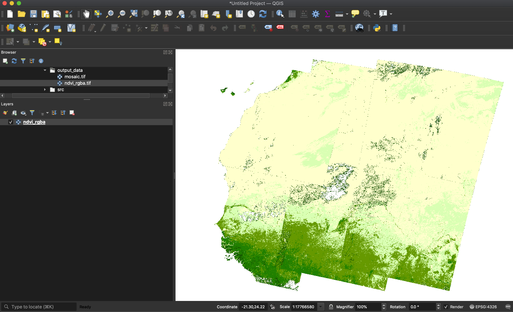

# Use Case Scenario #3 - Mosaicking/Land Monitoring - Integration Procedures

## Development Environment installation procedure

1. Provision a virtual machine on the target site. Preferably with the following specification

    - 2 CPUs, 8 GB RAM, 100 GB disk
    - CentOS 7
    - Python 3
    - With data offer access if available
  
2. Open a terminal on the provisioned machine and install some prequisites, and install, if necessary, **conda** on the virtual machine and create the conda environment.

   Transfer the included file _conda-install.sh_ on the virtual machine.

   Run the following commands:

   ```console
   sudo sh conda-install.sh
   source /opt/anaconda/etc/profile.d/conda.sh
   ```

   Transfer the the included file _environment.yml_ there and create a new conda environment (name **env_s3**). The conda environment should be created on a larger disk and should be manually linked from the conda installation directory:
  
   ```console
   sudo /opt/anaconda/bin/conda  env create -p $PWD/env_s3 --file environment.yml
   # This takes a while. Follow the instructions and confirm.

   sudo ln -s ${PWD}/env_s3 /opt/anaconda/envs/env_s3
   ```

   The application can be run without intitialising and activating the environment by simply launching the python executable from that directory.


## Integration procedure 

1.  Connect to a shell on the virtual machine. [5%]

2.  Upload the three python files used for the scenario (_s3\_olci\_mosaic.py_, _snap\_util\_helpers.py_ and _stage-in.py_) to the working directory using the _scp_ tool. [10%]

3.  **Using the target site data access and following the documentation available at the target site**, get the identifiers of a list of relevant Sentinel-3 OLCI Level 2 LFR products. [20%]
   
    For instance the following list contains the identifiers of products covering an area of Western Africa:

    ```
    S3A_OL_2_LFR____20210213T101140_20210213T101440_20210214T162238_0179_068_236_2520_LN1_O_NT_002
    S3A_OL_2_LFR____20210213T101440_20210213T101740_20210214T162252_0179_068_236_2700_LN1_O_NT_002
    S3A_OL_2_LFR____20210214T094529_20210214T094829_20210215T150935_0179_068_250_2520_LN1_O_NT_002
    S3A_OL_2_LFR____20210214T094829_20210214T095129_20210215T150946_0179_068_250_2700_LN1_O_NT_002
    S3B_OL_2_LFR____20210214T104659_20210214T104959_20210215T160947_0180_049_108_2520_LN1_O_NT_002
    S3B_OL_2_LFR____20210214T104959_20210214T105259_20210215T161009_0179_049_108_2700_LN1_O_NT_002
    ```
    [30%]

4.  Make the Sentinel-3 OLCI products available for the processing (stage-in).
   
    Create a directory `input_data` and download the files, if possible from the closest provider-specific source. A Python script is provided to simplify the procedure of making the data available, but this can be done also using simple shell commands in some cases. Create also the `output_data` directory which will contain the results of the processing.
   
    ```console
    mkdir input_data
    mkdir output_data
    ```

    * For **CREODIAS**, make sure your virtual machine has access to the EO Data volume (mounted under `/eodata/`). This is automatically the case for certain configurations/projects.

      - Automatic procedure

        ```console
        # Replace <identifier> with a product identifier from the list
  
        /opt/anaconda/bin/python stage-in.py id OL_2_LFR___ CREO <identifier> input_data/ ''
        ```

      - Manual procedure
    
        ```console
        # Replace <yyyy>, <mm>, <dd> and <identifier> with the appropriate values,
        # as in /eodata/Sentinel-3/OLCI/OL_2_LFR/2021/02/13/S3A_OL_2_LFR____20210213T101140_20210213T101440_20210214T162238_0179_068_236_2520_LN1_O_NT_002.SEN3
  
        cp -r /eodata/Sentinel-3/OLCI/OL_2_LFR/<yyyy>/<mm>/<dd>/<identifier>.SEN3 input_data/
        ```

    * For **MUNDI**, do the following:

      Install the **s3cmd** for S3 access:
     
      ```console
      /opt/anaconda/bin/s3cmd install s3cmd
      ```
      Configure the access to the MUNDI object store. The full procedure can be found at [this link](https://docs.otc.t-systems.com/en-us/ugs3cmd/obs/en-us_topic_0051060814.html).

      Run the following command:
      ```console
      /opt/anaconda/bin/s3cmd --configure
      ```
      You will be prompted for several settings. Enter the following values:

      * Access Key: *enter your MUNDI S3 key ID*
      * Secret Key: *enter your MUNDI S3 secret key*
      * Default Region: **eu-de**
      * S3 Endpoint: **obs.eu-de.otc.t-systems.com**
      * DNS-style bucket+hostname:port template for accessing a bucket: **%(bucket)s.obs.eu-de.otc.t-systems.com**
      * Encryption password: *confirm default*
      * Path to GPG program: *confirm default*
      * Use HTTPS protocol: *confirm default*
      * HTTP Proxy server name: *confirm default*
     
      Answer **n** (no) to an access test and **y** (yes) to saving the settings.

      Open the file *~/.s3cfg* for editing.

      Locate the line containing the setting for `website_endpoint` and change it to:
     
      ```
      website_endpoint = http://%(bucket)s.obs-website.%(location)s.otc.t-systems.com
      ```
      
      Rerun
      
      ```console
      /opt/anaconda/bin/s3cmd --configure
      ```
      Confirm all choices and run answer **Y** (yes) to the access test. It should be successful. Answer **N** (no) to saving the settings as they are already fine.

      Now, download the files into the correct location using **s3cmd**:

      - Automatic procedure

        ```console
        # Replace <identifier> with a product identifier from the list
        /opt/anaconda/bin/python stage-in.py id OL_2_LFR___ MUNDI <identifier> input_data/ ''
        ```

      - Manual procedure

        ```console
        # Replace <yyyy>, <mm>, <dd> and <identifier> with the appropriate values,
        # as in s3://s3-olci/LFR/2021/02/13/S3A_OL_2_LFR____20210213T101140_20210213T101440_20210214T162238_0179_068_236_2520_LN1_O_NT_002.zip/

        /opt/anaconda/bin/s3cmd get -r s3://s3-olci/LFR/<yyyy>/<mm>/<dd>/<identifier>.zip input_data/
        unzip -d input_data input_data/<identifier>.zip
        rm input_data/<identifier>.zip
        ```

    * For **ONDA**, do the following:
  
      In order to access the product files, it is necessary to mount the ENS file system. [This page](https://www.onda-dias.eu/cms/knowledge-base/adapi-how-to-mount-unmount/) has more information.

      ```console
      sudo mount -t nfs4 -o nfsvers=4.1 ens-legacy.onda-dias.eu:/ /eodata
      ```

      Note that copying files might not work due to a known issue with the ENS file system.
  
      - Automatic procedure

        ```console
        # Replace <identifier> with a product identifier from the list
  
        /opt/anaconda/bin/python stage-in.py id OL_2_LFR___ ONDA <identifier> input_data/ ''
        ```

      - Manual procedure
    
        ```console
        # Replace <yyyy>, <mm>, <dd> and <identifier> with the appropriate values,
        # as in /eodata/S3/OLCI/LEVEL-2/OL_2_LFR___/2021/02/13/S3A_OL_2_LFR____20210213T101140_20210213T101440_20210214T162238_0179_068_236_2520_LN1_O_NT_002.zip/S3A_OL_2_LFR____20210213T101140_20210213T101440_20210214T162238_0179_068_236_2520_LN1_O_NT_002.SEN3
        ```

   * For **Sobloo**, the download can be performed using the DirectData API.

      - Automatic procedure

        ```console
        # Replace <identifier> with a product identifier from the list and <apikey> with the Sobloo API key
  
        /opt/anaconda/bin/python stage-in.py id OL_2_LFR___ SOBLOO <identifier> input_data/ <apikey>
        ```

      - Manual procedure

        Not recommended as it consists in complicated steps and many individual downloads.
    
    
    At the end of this, the `input_data` directory should contain a number of directories with names ending in `.SEN3`, containing the actual files that compose each product.
    
    ```
    input_data
    ├── S3A_OL_2_LFR____20210213T101140_20210213T101440_20210214T162238_0179_068_236_2520_LN1_O_NT_002.SEN3
    │   ├── geo_coordinates.nc
    │   ├── instrument_data.nc
    │   ├── iwv.nc
    │   ├── lqsf.nc
    │   ├── ogvi.nc
    │   ├── otci.nc
    │   ├── rc_ogvi.nc
    │   ├── tie_geo_coordinates.nc
    │   ├── tie_geometries.nc
    │   ├── tie_meteo.nc
    │   ├── time_coordinates.nc
    │   └── xfdumanifest.xml
    ├── S3A_OL_2_LFR____20210213T101440_20210213T101740_20210214T162252_0179_068_236_2700_LN1_O_NT_002.SEN3
    │   ├── ...
    │   ... 
    ...
    ```

    [50%]

5.  At this point the mosaicking algorithm **`s3_olci_mosaic.py`** can be launched.
    
    It takes three parameters:
  
    * the input directory
    * the maximum cloud coverage above which a product is discarded (expressed as a floating-point value value between 0 and 1)
    * the output directory

    For example, with a maximum cloud coverage of 50% the command would be this (it has to be launched from within the correct environment):

    ```console
    /opt/anaconda/envs/env_s3/bin/python s3_olci_mosaic.py input_data/ 0.5 output_data/
    ```

    This may take a while; on a typical VM approximately 10 minutes per processed input file.
    Wait until the process has finished and check that there has been no error. [80%]

6. In the output directory there should be two files (the sizes vary depending on the number and nature of the input products) [90%]

   ```console
   $ ls -l output_data/
   -rw-rw-r--. 1 linux linux 291622599 Apr 30 10:00 mosaic.tif
   -rw-rw-r--. 1 linux linux 335049108 Apr 30 10:00 ndvi_rgba.tif
   ```

7. Download the file `ndvi_rgba.tif` onto your computer and open it with a tool such as QGIS. Verify that it shows the desired information (NDVI in the current configuration) of the area of interest. [100%]

   An typical image could look like this:
   


## Application build procedure 

A procedure for building a Docker image can be added if deemed necessary. However, the application can already be run fully automatically via the `cdab-remote-client` tool.
