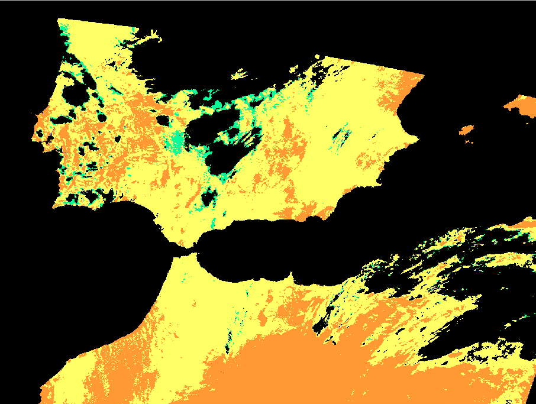

# Use Case Scenario #4 - Trends mapping - Integration Procedures

## Development Environment installation procedure

1. Provision a virtual machine on the target site. Preferably with the following specification

    - 2 CPUs, 8 GB RAM, 100 GB disk
    - CentOS 7
    - Python 3
    - With data offer access if available
  
2. Open a terminal on the provisioned machine and install some prequisites, and install, if necessary, **conda** on the virtual machine and create the conda environment.

   Transfer the included file _conda-install.sh_ on the virtual machine.

   Run the following commands:

   ```console
   sudo sh conda-install.sh
   source /opt/anaconda/etc/profile.d/conda.sh
   ```

   Transfer the the included file _environment.yml_ there and create a new conda environment (name **env_s3**). The conda environment should be created on a larger disk and should be manually linked from the conda installation directory:
  
   ```console
   sudo /opt/anaconda/bin/conda  env create -p $PWD/env_s3 --file environment.yml
   # This takes a while. Follow the instructions and confirm.

   sudo ln -s ${PWD}/env_s3 /opt/anaconda/envs/env_s3
   ```

   The application can be run without intitialising and activating the environment by simply launching the python executable from that directory.


## Integration procedure 

1.  Connect to a shell on the virtual machine. [5%]

2.  Upload the three python files used for the scenario (_s3\_slstr\_lst.py_, _snap\_util\_helpers.py_ and _stage-in.py_) to the working directory using the _scp_ tool. If you use a WEkEO virtual machine, upload the _wekeo-tool.py_ script instead of _stage-in.py_. [10%]

3.  **Using the target site data access and following the documentation available at the target site**, get the identifiers of a list of relevant Sentinel-3 SLSTR Level 2 LST products. [20%]
   
    For instance the following list contains the identifiers of products covering an area of Northwestern Africa and Southern Iberia: 

    ```
    S3A_SL_2_LST____20210425T110535_20210425T110835_20210426T211759_0179_071_094_2160_LN2_O_NT_004
    S3B_SL_2_LST____20210425T102904_20210425T103204_20210426T210428_0179_051_336_2340_LN2_O_NT_004
    ```
    [30%]

4.  Make the Sentinel-3 SLSTR products available for the processing (stage-in).
   
    Create a directory `input_data` and download the files, if possible from the closest provider-specific source. A Python script is provided to simplify the procedure of making the data available, but this can be done also using simple shell commands in some cases. Create also the `output_data` directory which will contain the results of the processing.
   
    ```console
    mkdir input_data
    mkdir output_data
    ```

    * For **CREODIAS**, make sure your virtual machine has access to the EO Data volume (mounted under `/eodata/`). This is automatically the case for certain configurations/projects.

      - Automatic procedure

        ```console
        # Replace <identifier> with a product identifier from the list
  
        /opt/anaconda/bin/python stage-in.py id SL_2_LST___ CREO <identifier> input_data/ ''
        ```

      - Manual procedure
    
        ```console
        # Replace <yyyy>, <mm>, <dd> and <identifier> with the appropriate values,
        # as in /eodata/Sentinel-3/SLSTR/SL_2_LST/2021/04/25/S3B_SL_2_LST____20210425T102904_20210425T103204_20210426T210428_0179_051_336_2340_LN2_O_NT_004.SEN3
  
        cp -r /eodata/Sentinel-3/SLSTR/SL_2_LST/<yyyy>/<mm>/<dd>/<identifier>.SEN3 input_data/
        ```

    * For **MUNDI**, Sentinel-3 SLSTR data is not locally available.

      Obtain the data from another source, such as Copernicus API Hub.


    * For **ONDA**, do the following:
  
      In order to access the product files, it is necessary to mount the ENS file system. [This page](https://www.onda-dias.eu/cms/knowledge-base/adapi-how-to-mount-unmount/) has more information.

      ```console
      sudo mount -t nfs4 -o nfsvers=4.1 ens-legacy.onda-dias.eu:/ /eodata
      ```

      Note that copying files might not work due to a known issue with the ENS file system.
  
      - Automatic procedure

        ```console
        # Replace <identifier> with a product identifier from the list
  
        /opt/anaconda/bin/python stage-in.py id SL_2_LST___ ONDA <identifier> input_data/ ''
        ```

      - Manual procedure
    
        ```console
        # Replace <yyyy>, <mm>, <dd> and <identifier> with the appropriate values,
        # as in /eodata/S3/SLSTR/LEVEL-2/SL_2_LST___/2021/04/25/S3B_SL_2_LST____20210425T102904_20210425T103204_20210426T210428_0179_051_336_2340_LN2_O_NT_004.zip/S3B_SL_2_LST____20210425T102904_20210425T103204_20210426T210428_0179_051_336_2340_LN2_O_NT_004.SEN3
  
        cp -r /eodata/S3/SLSTR/LEVEL-2/SL_2_LST___/<yyyy>/<mm>/<dd>/<identifier>.SEN3.zip/<identifier>.SEN3 input_data/
        ```

   * For **Sobloo**, the download can be performed using the DirectData API.

      - Automatic procedure

        ```console
        # Replace <identifier> with a product identifier from the list and <apikey> with the Sobloo API key
  
        /opt/anaconda/bin/python stage-in.py id SL_2_LST___ SOBLOO <identifier> input_data/ <apikey>
        ```

      - Manual procedure

        Not recommended as it consists in complicated steps and many individual downloads.
    
    
   * For **WEkEO**, do the following:

      - Semi-automatic procedure

        Set the environment variable `WEKEO_CREDS` with your WEkEO username and password:

        ```console

        # Set the credentials with your WEkEO username and password
        WEKEO_CREDS='<username>:<password>'

        # Replace <identifier> with a product identifier
        python3 wekeo-tool.py query --credentials="$WEKEO_CREDS" --pn=Sentinel-3 --pt=SL_2_LST___ --uid=<identifier> > <identifier>.url

        python3 wekeo-tool.py download --credentials="$WEKEO_CREDS" --url="$(cat <identifier>.url)" --dest="<identifier>.zip"

        unzip -d input_data/ <identifier>.zip
        ```

      - Manual procedure

        There is no manual procedure for the download. It would be complicated to do the necessary requests without the support from a script.


    At the end of this, the `input_data` directory should contain a number of directories with names ending in `.SEN3`, containing the actual files that compose each product.
    
    ```
    input_data
    ├── S3A_SL_2_LST____20210425T110535_20210425T110835_20210426T211759_0179_071_094_2160_LN2_O_NT_004.SEN3
    │   ├── cartesian_in.nc
    │   ├── cartesian_tx.nc
    │   ├── flags_in.nc
    │   ├── geodetic_in.nc
    │   ├── geodetic_tx.nc
    │   ├── geometry_tn.nc
    │   ├── indices_in.nc
    │   ├── LST_ancillary_ds.nc
    │   ├── LST_in.nc
    │   ├── met_tx.nc
    │   ├── time_in.nc
    │   └── xfdumanifest.xml
    └── S3B_SL_2_LST____20210425T102904_20210425T103204_20210426T210428_0179_051_336_2340_LN2_O_NT_004.SEN3
        ├── ...
        ...
    ```

    [50%]

5.  At this point the trends mapping algorithm **`s3_slstr_lst.py`** can be launched.
    
    It takes two parameters:
  
    * the input directory (use an absolute path)
    * the output directory (use an absolute path)

    For example, the command could look like this (it has to be launched from within the correct environment):

    ```console
    /opt/anaconda/envs/env_s3/bin/python s3_slstr_lst.py $PWD/input_data/ $PWD/output_data/
    ```

    This may take a while; on a typical VM approximately 5 minutes per processed input file.
    Wait until the process has finished and check that there has been no error. [80%]

6. In the output directory there should be the following contents, two GeoTIFF files and one SNAP GPT grpah XML file per input file (the sizes vary depending on the number and nature of the input products) [90%]

   ```console
   $ ls -l output_data/
   -rw-rw-r--. 1 centos centos     1702 May 31 16:40 graph_S3A_SL_2_LST____20210425T110535_20210425T110835_20210426T211759_0179_071_094_2160_LN2_O_NT_004.xml
   -rw-rw-r--. 1 centos centos     1702 May 31 16:37 graph_S3B_SL_2_LST____20210425T102904_20210425T103204_20210426T210428_0179_051_336_2340_LN2_O_NT_004.xml
   -rw-rw-r--. 1 centos centos   294126 May 31 16:42 lst_S3A_SL_2_LST____20210425T110535_20210425T110835_20210426T211759_0179_071_094_2160_LN2_O_NT_004.tif
   -rw-rw-r--. 1 centos centos   925298 May 31 16:40 lst_S3B_SL_2_LST____20210425T102904_20210425T103204_20210426T210428_0179_051_336_2340_LN2_O_NT_004.tif
   -rw-rw-r--. 1 centos centos 12339468 May 31 16:42 rgba_S3A_SL_2_LST____20210425T110535_20210425T110835_20210426T211759_0179_071_094_2160_LN2_O_NT_004.tif
   -rw-rw-r--. 1 centos centos 10451496 May 31 16:40 rgba_S3B_SL_2_LST____20210425T102904_20210425T103204_20210426T210428_0179_051_336_2340_LN2_O_NT_004.tif
   ```

7. Download the files `rgba_*.tif` onto your computer and open it with a tool such as QGIS. Verify that it shows the desired information (land surface temperature) of the area of interest. [100%]

   A typical image could look like this:
   


## Application build procedure 

A procedure for building a Docker image can be added if deemed necessary. However, the application can already be run fully automatically via the `cdab-remote-client` tool.
